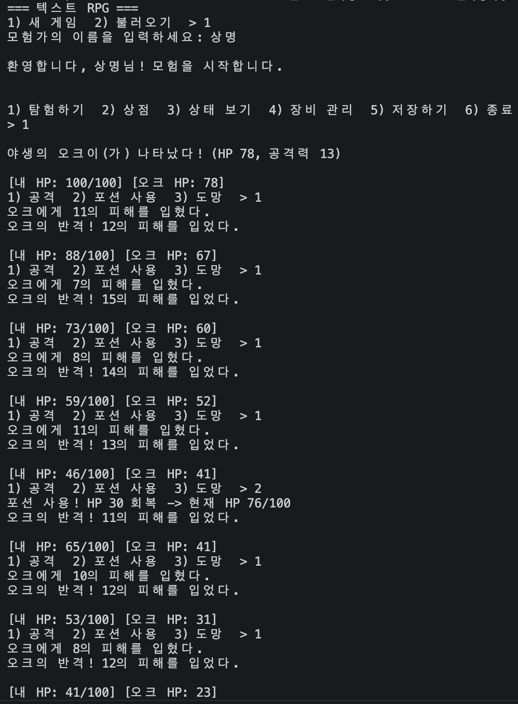

# 텍스트 기반 미니 RPG

파이썬 입문자를 위한 실습용 텍스트 RPG입니다. 몬스터를 사냥해 레벨업하고, 장비를 모아 더 강한 몬스터에 도전하는 구조입니다.

## 실행 방법

```bash
python3 text_rpg.py
```

Python 3.9 이상이면 동작합니다. 외부 라이브러리 없이 표준 라이브러리(`json`, `random`, `dataclasses`, `pathlib`)만 사용합니다.

## 실행 결과(통합, 추후 분리하여 업데이트 예정)




## 게임 방법

시작하면 새 게임 또는 저장된 게임 불러오기를 선택합니다. 이후 메인 메뉴에서 아래 행동을 선택할 수 있습니다.

| 번호 | 행동 | 설명 |
|---|---|---|
| 1 | 탐험하기 | 몬스터와 조우해 전투를 시작합니다 |
| 2 | 상점 | 포션을 등급별로 원하는 개수만큼 구매하거나, 미착용 장비를 일괄 판매합니다 |
| 3 | 상태 보기 | 레벨·HP·공격력·장착 장비를 확인합니다 |
| 4 | 장비 관리 | 미착용 장비를 확인하고 장착 교체합니다 |
| 5 | 저장하기 | 현재 진행 상황을 `savegame.json`에 저장합니다 |
| 6 | 종료 | 저장 여부를 확인한 뒤 게임을 종료합니다 |

전투 중에는 공격 / 포션 사용 / 도망 중 하나를 선택합니다. HP가 0 이하가 되면 게임 오버입니다.

도망은 **90% 확률로 성공**합니다. 실패(10%)하면 몬스터의 반격을 한 번 맞고 전투가 계속됩니다.

## 핵심 규칙

### 포션
포션은 5개 등급으로 나뉘며, 등급이 높을수록 회복량과 가격이 함께 커집니다. 새 게임을 시작하면 일반 포션 2개를 가지고 시작합니다.

| 등급 | 회복량 | 가격 |
|---|---|---|
| 일반 | HP+10 | 10골드 |
| 고급 | HP+50 | 50골드 |
| 희귀 | HP+100 | 100골드 |
| 영웅 | HP+250 | 250골드 |
| 전설 | HP+500 | 500골드 |

전투 중 "2) 포션 사용"을 선택하면 보유한 등급 중 어떤 것을 쓸지 고를 수 있고, 상점에서도 등급과 개수를 지정해 구매합니다.

### 몬스터 출현
몬스터 출현 확률은 **플레이어 레벨과 무관하게 항상 고정**입니다 (`weight` 값의 합이 100).

| 몬스터 | 출현 확률 | 전투력 배율 |
|---|---|---|
| 슬라임 | 10% | 1.0 |
| 고블린 | 15% | 1.4 |
| 놀 | 20% | 1.9 |
| 오크 | 20% | 2.6 |
| 트롤 | 10% | 3.6 |
| 오거 | 10% | 4.8 |
| 마족 | 10% | 6.4 |
| 드래곤 | 5% | 9.0 |

대신 몬스터의 실제 HP·공격력은 **조우하는 순간 플레이어 레벨을 기준으로 다시 계산**됩니다. 전투력 배율이 큰 몬스터일수록 레벨에 따른 스탯 증가폭이 훨씬 커서, 레벨업만으로는 상위 티어 몬스터(트롤 이상)를 이길 수 없습니다. 장비로 보완해야 합니다.

### 게임 클리어 조건 (마왕)
**레벨 10에 도달하면 탐험 시 일반 몬스터 대신 마왕이 나타납니다.** 마왕을 물리치면 게임 클리어입니다.

마왕의 스펙은 매우 높게 설정되어 있어서, 장비가 부실하면 몇 턴 안에 전멸합니다. 6부위를 모두 높은 등급(희귀 이상, 이상적으로는 전설)으로 채워야 승산이 생기도록 밸런싱되어 있습니다. 도망도 가능하지만 실패하면 반격을 맞으므로, 승산이 없다면 장비를 더 갖춘 뒤 재도전하는 편이 안전합니다.

### 장비
몬스터를 처치하면 장비가 하나 드랍됩니다.

- **부위** (6종): 무기, 투구, 상의, 하의, 장갑, 신발
  - 무기: 공격력만
  - 상의·하의: HP만
  - 투구·장갑·신발: 공격력 + HP
- **등급** (드랍 확률 고정): 일반 70%, 고급 16%, 희귀 8%, 영웅 5%, 전설 1%
- 장비 수치는 **획득 당시 레벨 + 등급**에 비례한 범위 내에서 랜덤으로 결정됩니다. 같은 등급이라도 레벨이 높을 때 얻은 장비가 더 강합니다.

드랍되면 **현재 장착 중인 같은 부위 장비와 스탯을 비교**해서 보여주고, 바로 장착할지 물어봅니다. 장착하지 않으면 인벤토리에 보관되며, 나중에 "4) 장비 관리"에서 교체하거나 "2) 상점"에서 등급별 가격에 일괄 판매해 골드로 바꿀 수 있습니다.

| 등급 | 판매 가격 |
|---|---|
| 일반 | 5골드 |
| 고급 | 15골드 |
| 희귀 | 40골드 |
| 영웅 | 100골드 |
| 전설 | 300골드 |

## 파일 구성

```
advanced_text_rpg/
├── text_rpg.py           # 게임 전체 로직
├── data/
│   ├── monsters.json     # 몬스터 목록 + 마왕(보스) 스펙
│   ├── equipment.json    # 장비 부위별 스탯 범위, 등급별 확률·배율·판매가
│   ├── potions.json      # 포션 등급별 회복량·가격
│   └── balance.json      # 성장치, 도망 실패 확률 등 밸런스 상수
├── savegame.json         # 저장하기 실행 시 생성되는 세이브 파일 (git에는 올리지 않는 것을 권장)
└── README.md
```

## 밸런스 조절하기

코드를 건드리지 않고 `data/` 아래 JSON 파일 값만 수정하면 난이도를 조절할 수 있습니다.

- `data/monsters.json`
  - `monsters[].power`: 몬스터별 전투력 배율
  - `boss.power`: 마왕 전투력 배율 (클리어 난이도에 직결)
  - `boss.level_requirement`: 마왕이 나타나는 레벨 (기본 10)
- `data/equipment.json`
  - `grades[].multiplier`: 등급별 장비 스탯 배율
  - `grades[].sell_price`: 상점 일괄 판매 시 등급별 골드
- `data/potions.json`
  - `potions[].heal`, `potions[].price`: 등급별 회복량과 가격
- `data/balance.json`
  - `attack_growth_per_level`, `hp_growth_per_level`: 레벨당 장비 스탯 성장폭
  - `flee_fail_chance`: 도망 실패 확률 (기본 0.1)
  - `level_up_hp_gain`, `level_up_attack_gain`: 레벨업 시 캐릭터 기본 스탯 성장폭

## 알려진 제약

- 저장 파일 하나만 지원합니다 (슬롯 여러 개 저장 불가).
- 미착용 장비는 등급별 고정가로 일괄 판매만 가능하고, 개별 판매·버리기는 지원하지 않습니다.

## 앞으로 추가할 기능 (로드맵)

- 저장 슬롯 여러 개 지원 (파일명에 슬롯 번호 부여)
- 미착용 장비 개별 판매·버리기 기능 추가
- Pydantic으로 `data/*.json` 로드 시점 검증 (오타나 잘못된 값이 들어간 데이터 파일을 실행 전에 걸러내기)
- 몬스터·장비 데이터 검증 및 게임 로직에 대한 pytest 테스트 추가
