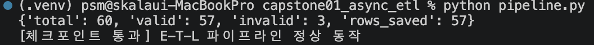
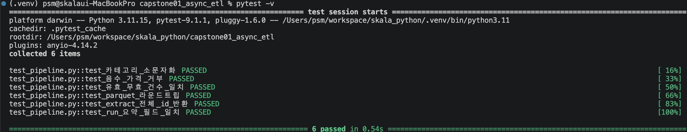

# 종합실습 1 · 비동기 ETL 파이프라인

실습 3(비동기 세마포어+재시도 수집)과 실습 2(Pydantic 검증)를 하나의 재사용 가능한
E(xtract)-T(ransform)-L(oad) 파이프라인으로 엮고, pytest로 각 단계를 독립적으로 검증한다.

```
capstone01_async_etl/
├── models.py         # Pydantic 모델 (실습 2 패턴 재사용)
├── pipeline.py        # extract() / transform() / load() / run()
└── test_pipeline.py   # pytest 테스트 6개
```

## 실행 방법

```bash
cd skala_python

# 1) 파이프라인 실행
.venv/bin/python capstone01_async_etl/pipeline.py

# 2) 테스트 실행
cd capstone01_async_etl
/Users/psm/workspace/skala_python/.venv/bin/python -m pytest -v
```

## 실행 결과

### 파이프라인 실행 (`pipeline.py`)



> `capstone01_async_etl/screenshot_pipeline.png` 경로로 저장하세요. (요약 딕셔너리 `{'total': 60, 'valid': 57, 'invalid': 3, 'rows_saved': 57}`와 체크포인트 통과 메시지)

### 테스트 실행 (`pytest -v`)



> `capstone01_async_etl/screenshot_pytest.png` 경로로 저장하세요. (6개 테스트 모두 PASSED로 나오는 화면)

실행 후 `output/products.csv`, `output/products.parquet`가 생성된다(`.gitignore`에 등록되어 있어 git에는 커밋되지 않음).

## 결과물에 대한 평가

### 체크포인트 충족 여부

| 가이드 성공 판정 기준 | 실제 결과 | 충족 |
|---|---|---|
| `pipeline.py` → 요약 딕셔너리 출력, 오류 없음 | `{'total': 60, 'valid': 57, 'invalid': 3, 'rows_saved': 57}` | ✅ |
| `pytest -v` → 6개 테스트 모두 PASSED | `6 passed in 0.30s` | ✅ |
| 검증 항목: 카테고리 정규화·가격 규칙·유효/무효 건수 일치·Parquet 라운드트립 | 4가지 모두 테스트로 커버됨 | ✅ |
| `ruff check . && ruff format .` 통과 | `All checks passed!` | ✅ |
| `output/`에 CSV·Parquet 생성 | `products.csv`, `products.parquet` 생성 확인 | ✅ |

### 잘된 점
- `transform()`(순수 함수)과 `extract()`/`load()`(네트워크·파일 접근)를 명확히 분리해, 문서가 강조하는 "테스트 가능한 구조"를 실제로 구현했다. 6개 테스트 중 3개(`transform` 관련)는 네트워크·파일 없이 1초 안에 끝난다.
- `run()`이 E→T→L을 순서대로 호출만 하고 자체 로직이 없어("조율만 하고 일은 안 함"), 저장 형식을 바꾸는 것 같은 변경이 `load()` 한 곳으로 국한된다.
- 모의 데이터(`_MOCK_DB`)에 음수 가격 3건(id 5/17/42)을 의도적으로 심어두고, `test_run_요약_필드_일치`에서 `summary["invalid"] == 3`을 명시적으로 검증해 — "우연히 통과한 테스트"가 아니라 데이터 설계와 검증이 서로 근거를 가지고 맞물려 있다.
- `extract()`가 실습3의 세마포어+타임아웃+지수 백오프 구조를 그대로 재사용하면서도, 실패 시 dict가 아니라 예외를 `raise`하도록 바꿔 `return_exceptions=True`로 상위에서 통일되게 처리하도록 설계를 다듬었다(단순 복붙이 아니라 호출부 계약에 맞게 조정함).

### 한계 / 아쉬운 점
- `_MOCK_DB`가 60개 고정 레코드라서, `extract(ids)`에 `_MOCK_DB`에 없는 id(예: 100)를 넣으면 재시도를 3번 소진한 뒤 예외가 `raise`되고 `extract()`가 조용히 걸러낸다. 이 경로에 대한 pytest 테스트는 없어서(존재하는 id로만 테스트함), "존재하지 않는 id 처리"는 코드는 있지만 검증되지 않은 상태다.
- `load()`가 `output_dir`을 매번 같은 파일명(`products.csv`/`products.parquet`)으로 덮어쓴다. 종합실습3의 타임스탬프 파일명 관례를 여기에도 적용하면 이력 비교가 가능해지겠지만, 이 실습의 범위(파이프라인 구조 검증)에서는 필수 요구사항이 아니었다.
- 코드 품질 검사는 `ruff check`/`format`까지만 수행했고, 타입 체커(`mypy` 등)는 적용하지 않았다 — 가이드 문서에도 요구되지 않아 범위 밖이지만, 실무라면 고려할 만하다.