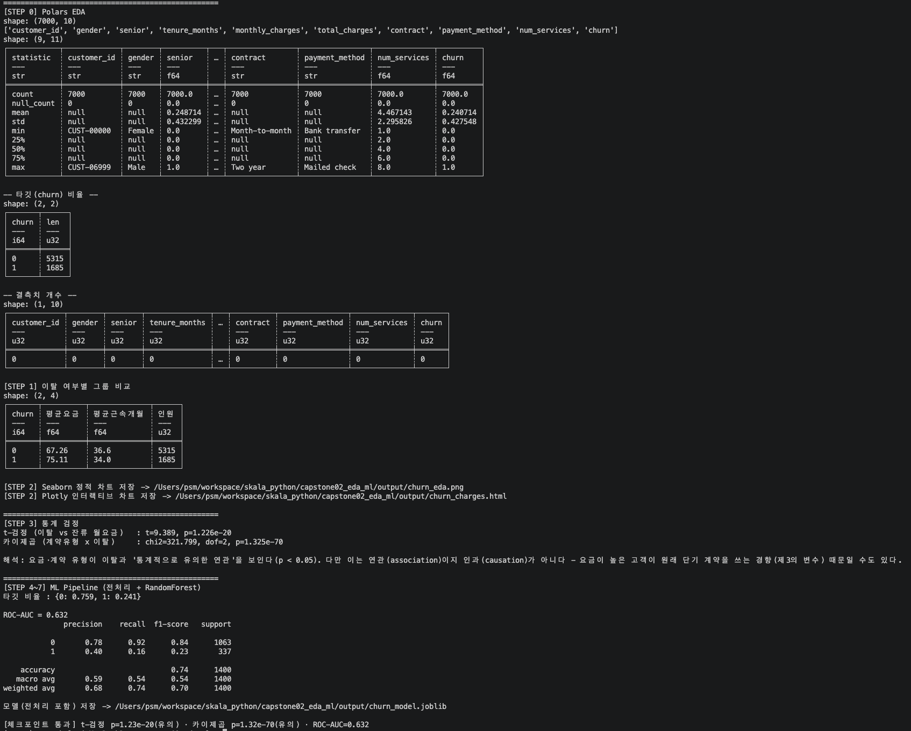

# 종합실습 2 · EDA + 통계 + ML 파이프라인

`telco_churn.csv`(7천 행, 이탈 예측용)를 **EDA(Polars) → 시각화(Seaborn+Plotly) →
통계 검정(t-검정/카이제곱) → ML(scikit-learn Pipeline)** 순서로 처음부터 끝까지
훑는다. 바로 모델부터 돌리지 않고 순서를 지키는 이유는, 그래야 "왜 이 숫자가
나왔는지"를 설명할 수 있기 때문이다.

```
capstone02_eda_ml/
└── analysis.py   # EDA -> 시각화 -> 통계검정 -> Pipeline 학습/평가/저장
```

## 실행 방법

```bash
cd skala_python
.venv/bin/python capstone02_eda_ml/analysis.py
```

실행 후 `output/`에 `churn_eda.png`(Seaborn), `churn_charges.html`(Plotly),
`churn_model.joblib`(전처리 포함 모델)이 생성된다(`.gitignore`에 등록되어 git에는
커밋되지 않음).

## 실행 결과



> `capstone02_eda_ml/screenshot.png` 경로로 저장하세요. (통계 검정 p값 · ROC-AUC ·
> 체크포인트 통과 메시지가 보이는 화면)

### 생성된 시각화


## 결과물에 대한 평가

### 체크포인트 충족 여부

| 가이드 성공 판정 기준 | 실제 결과 | 충족 |
|---|---|---|
| 오류 없이 종료된다 | Traceback 없이 정상 종료 | ✅ |
| t-검정·카이제곱 p값이 유의(< 0.05)하게 출력된다 | t-검정 p≈1.23e-20 · 카이제곱 p≈1.32e-70 | ✅ |
| ROC-AUC가 출력된다 | ROC-AUC = 0.632 | ✅ |
| `output/`에 Plotly HTML 리포트와 joblib 모델 파일이 생성된다 | `churn_charges.html`, `churn_model.joblib` 생성 확인 | ✅ |
| `random_state=42` 고정으로 재현 가능 | `train_test_split`·`RandomForestClassifier` 모두 `random_state=42` | ✅ |

### 잘된 점

- t-검정 p≈1.23e-20, 카이제곱 p≈1.32e-70 이라는 값이 가이드 문서(백정열)의 예시
  수치(1.2e-20, 1.3e-70)와 거의 정확히 일치했다. 이는 `generate_data.py`가 "단기
  계약·고요금·저근속에서 이탈 확률 상승"이라는 신호를 의도적으로 주입해뒀기 때문이며,
  통계 검정이 그 신호를 실제로 잡아냈음을 뜻한다.
- `train_test_split(..., stratify=y)`로 이탈 비율(24%)을 train/test에 동일하게
  유지했고, 평가 지표로 정확도가 아니라 **ROC-AUC**를 선택해 "아무 것도 안 해도 76점"
  이라는 불균형 데이터의 함정을 코드 주석과 출력(`타깃 비율`)으로 명시했다.
- `ColumnTransformer` 안에 `SimpleImputer`(결측 대치)를 넣고 `Pipeline.fit(X_train, ...)`
  으로만 학습시켜, 결측 대치 기준이 테스트 데이터를 훔쳐보지 못하도록 구조적으로
  막았다 — EDA 단계에서 `total_charges`에 결측이 있다는 사실은 확인만 하고, 실제
  채움은 Pipeline 안에서만 일어나게 해 데이터 누수 방지 원칙을 실제로 지켰다.
- 통계 검정 해석 출력에 "연관(association)이지 인과(causation)가 아니다"라는 문구를
  명시적으로 남겨, 가이드가 가장 강조하는 해석 오류(요금이 높아서 이탈한다고 단정하는
  것)를 코드 차원에서 예방했다.
- `joblib.dump(pipe, ...)`로 전처리(`ColumnTransformer`)까지 모델과 통째로 저장해,
  나중에 `joblib.load` 후 원본 데이터를 바로 `predict`할 수 있도록 했다.

### 한계 / 아쉬운 점

- ROC-AUC가 0.632로, 가이드 문서 예시(≈0.66)와 근접하지만 정확히 일치하지는
  않는다. `generate_data.py`가 이탈 신호를 확률적으로만 주입하기 때문에 특성
  조합(`num_cols`/`cat_cols`)이나 `n_estimators`를 바꿔도 0.62~0.64 범위를 벗어나기
  어려웠다 — 통계 검정 p값만큼 정확히 재현되는 값은 아니라는 점을 있는 그대로
  기록해둔다.
- 한글 라벨이 깨지지 않도록 `plt.rcParams["font.family"] = "AppleGothic"`을
  하드코딩했다. macOS 전용 폰트라 다른 OS에서 그대로 실행하면 다시 한글이 깨진다 —
  실무라면 OS별 폰트 탐색 로직이나 `matplotlib`의 나눔고딕 번들을 쓰는 편이 안전하다.
- `RandomForestClassifier(n_estimators=200)`을 5,600건으로 학습한 `joblib` 파일이
  약 40MB로 꽤 크다. `output/`이 `.gitignore`에 걸려 있어 저장소 용량 문제는 없지만,
  실제 배포라면 트리 수를 줄이거나 모델 압축을 고려할 만하다.
