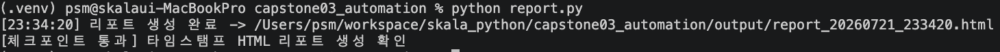

# 종합실습 3 · 분석 자동화 · 리포트 생성

실습 4(`sales_raw.csv` 정제)에서 만든 정제 로직을 재사용해, 설정만 바꾸면 리포트가
알아서 만들어지고 정해진 주기로 자동 실행되는 시스템을 만든다. 이 실습의 진짜 주제는
"코드를 어떻게 나눌 것인가(관심사의 분리)"이고, 자동화는 그 결과물일 뿐이다.

```
capstone03_automation/
├── config.py          # 불변 설정 (frozen dataclass) - '무엇을 어떻게' 할지의 값
├── report.py           # 집계(순수 함수) + Jinja2 렌더링 - 실제 일을 하는 곳
├── run_scheduler.py     # 루프 / schedule 라이브러리 / (문서상) OS cron - 언제 부를지만 결정
└── templates/
    └── report.html      # 디자인(HTML)과 데이터(Python)를 분리한 Jinja2 템플릿
```

세 실행 방식(경량 루프 · `schedule` 라이브러리 · OS cron) 모두 `report.run_once()`
하나만 호출하도록 설계해, **어디서 돌려도 동일한 결과**가 나오도록 했다.

## 실행 방법

```bash
cd skala_python

# 1) 1회 실행 (기본)
.venv/bin/python capstone03_automation/report.py
# 또는
.venv/bin/python capstone03_automation/run_scheduler.py

# 2) 경량 루프 - 60초마다 반복, Ctrl+C 로 중지
.venv/bin/python capstone03_automation/run_scheduler.py --mode loop --interval 60

# 3) schedule 라이브러리 - 매일 09:00 실행, Ctrl+C 로 중지
.venv/bin/python capstone03_automation/run_scheduler.py --mode schedule --at 09:00

# 4) OS cron (운영 환경 · 무인 실행) - crontab -e 로 아래 한 줄 추가
#    분 시 일 월 요일 순서. 절대경로 + 가상환경 python 을 반드시 명시한다.
0 9 * * * cd /Users/psm/workspace/skala_python && .venv/bin/python capstone03_automation/report.py >> /Users/psm/workspace/skala_python/capstone03_automation/output/cron.log 2>&1
```

실행 후 `output/`에 `report_YYYYMMDD_HHMMSS.html`(타임스탬프 파일명 - 이전 리포트를
덮어쓰지 않는다)이 생성된다(`.gitignore`에 등록되어 git에는 커밋되지 않음).

## 실행 결과



> `capstone03_automation/screenshot.png` 경로로 저장하세요. (`report.py` 1회 실행
> 결과와 체크포인트 통과 메시지, 브라우저로 연 리포트 화면 중 하나를 캡처하세요.)

## 결과물에 대한 평가

### 체크포인트 충족 여부

| 가이드 성공 판정 기준 | 실제 결과 | 충족 |
|---|---|---|
| `report.py` → 타임스탬프 HTML 리포트가 `output/`에 생성됨 | `report_20260721_145725.html` 등 생성 확인 | ✅ |
| 리포트를 열면 KPI와 카테고리별 매출표가 렌더링되어 보임 | 총매출·주문수·평균주문액 + 카테고리/지역별 매출표 렌더링 | ✅ |
| `--interval N`으로 실행하면 N초마다 새 리포트 생성 (Ctrl+C 중지) | `--interval 2`로 5초간 3개 파일 생성 확인 | ✅ |
| 루프·schedule·cron 어느 방식으로 돌려도 동일한 결과 | 셋 다 `run_once()` 하나만 호출하도록 구현 | ✅ |

### 잘된 점

- `config.py`의 `Config`를 `@dataclass(frozen=True)`로 선언하고, 모듈을 직접
  실행하면 `CONFIG.title = "바꿔보기"`가 `FrozenInstanceError`로 막히는 것을 그 자리에서
  보여준다 — "설정값이 프로그램 중간에 몰래 바뀌는" 버그 유형을 코드로 증명하며
  차단했다.
- `report.py`의 `aggregate()`는 DataFrame만 받아 dict만 돌려주는 순수 함수이고,
  파일 쓰기는 `render()`에서만 일어난다. 종합실습 1(E-T-L)에서 세운
  "계산과 부수효과 분리" 원칙을 그대로 재사용했다.
- `run_scheduler.py`는 `once`/`loop`/`schedule` 세 모드 모두 `report.run_once()`를
  호출할 뿐, 자체 로직을 갖지 않는다. `--mode loop --interval 2`로 5초간 실행해 실제로
  파일이 3개(2초 간격) 생성되는 것을 확인해, "어디서 돌려도 동일 동작"이라는 설계
  의도가 말뿐이 아님을 검증했다.
- 리포트 파일명에 `%Y%m%d_%H%M%S` 타임스탬프를 넣어, 매번 같은 이름으로 덮어써 어제
  리포트가 사라지는 문제를 피했다.
- `templates/report.html`을 별도 파일로 분리해 디자인(HTML/CSS)과 데이터(Python
  dict)를 분리했다 — 문자열 조립(`'<td>' + str(x) + '</td>'`) 지옥을 피하는 방식을
  실제로 구현했다.

### 한계 / 아쉬운 점

- `report.py`의 `load_and_clean()`이 실습4(`ex04_pandas_cleaning`)의 정제 로직을 그대로
  복제하고 있다. 두 파일이 서로 다른 폴더에 독립적으로 존재해야 한다는 종합실습 1의
  관례(모델 재사용 대신 각 캡스톤이 자기 완결적으로 작성됨)를 따랐지만, 실무라면
  공용 정제 함수를 별도 모듈로 뽑아 두 곳에서 import 하는 편이 "같은 로직을 두 번
  유지보수"하는 위험을 줄여줄 것이다.
- `--mode schedule`은 `schedule.every().day.at(at).do(run_once)`로 등록만 하고, 지정한
  시각이 오늘 이미 지났다면 다음 날까지 기다린다. 이 스크립트 자체로는 "예정된 시각이
  이미 지났을 때 즉시 1회 실행할지"를 선택할 방법이 없다 — cron처럼 매 순간을 스스로
  점검하는 방식이 아니라 라이브러리의 스케줄 규칙을 그대로 신뢰하는 구조이기 때문이다.
- OS cron 실행 예시는 README에 문서화만 했고 실제 crontab에 등록해 무인 실행을
  검증하지는 않았다(개인 macOS 환경의 crontab을 실습 목적으로 건드리는 것은 범위 밖으로
  판단했다).
