# 종합실습 1 — 학사관리시스템 DB 설계부터 조회까지

## 1. 이 시스템에서 뭘 관리해야 하는지 (요구사항)

학사관리시스템이니까, 학교에서 실제로 관리해야 하는 대상을 먼저 정리해봤습니다. 
학과, 교수, 학생, 강좌, 그리고 학생이 강좌를 신청하는 수강신청 — 이렇게 5가지로 구성하기로 했고 각각 테이블로 만들기로 했습니다.

학과는 컴퓨터공학·경영학·전자공학·국어국문학·기계공학 5개로 시작했는데, 테이블마다 데이터를 최소 10건 이상 넣어야 한다는 조건에 맞추면서 인공지능학과·통계학과·법학과·화학공학과·건축학과 5개를 추가로 개설해 총 10개 학과 체제로 구성했습니다. 최종적으로 10개 학과 아래 교수 15명, 학생 20명, 강좌 15개가 연결되어 있고, 이 학생들이 강좌를 신청한 수강신청 기록이 25건입니다.

### 1.1 테이블 구성

| 테이블 | 설명 |
|---|---|
| majors (학과) | 컴퓨터공학, 경영학과 같은 학과 정보 |
| professors (교수) | 어느 학과 소속인지 같이 저장 |
| students (학생) | 어느 학과·몇 학년인지 저장 |
| courses (강좌) | 어떤 교수가 담당하는지 저장 |
| enrollments (수강신청) | 어떤 학생이 어떤 강좌를 들었는지, 성적까지 저장 |

학과와 학생/교수는 "학과 하나에 여러 명이 속하는" 관계라서, 학생·교수 테이블에 학과의 번호(FK, 다른 테이블 값을 그대로 가져와 연결하는 컬럼)만 넣었습니다.
반면 학생과 강좌는 "학생 한 명이 여러 강좌를 듣고, 강좌 하나도 여러 학생이 듣는" 관계라서 이렇게 FK 하나로는 표현이 안된다고 판단하여 `enrollments`라는 테이블을 중간에 하나 더 만들어서, 거기에 학생 번호와 강좌 번호를 같이 저장하는 방식으로 풀었습니다.

### 1.2 학과/교수 이름을 따로 뺀 이유

처음엔 학생 테이블에 학과 이름을 그냥 string 변수로 적으려고 했는데, 그러면 같은 학과 학생이 여러 명일 때 "컴퓨터공학"이라는 글자가 학생 수만큼 계속 중복 저장됩니다. 나중에 학과 이름이 바뀌면 그 많은 행을 일일이 다 고쳐야 하고, 하나라도 빠뜨리면 데이터가 서로 안 맞게 됩니다. 그래서 학과 정보는 `majors` 테이블 하나에만 저장해두고, 학생·교수 테이블은 그 학과의 ID 값만 가지고 있게 했습니다.

### 1.3 컬럼을 정할 때 고민한 것들

- 각 테이블을 구분하는 고유 번호(PK)는 자동으로 1씩 늘어나는 정수로 지정했습니다.
- 성적처럼 소수점 계산이 정확해야 하는 값은 오차 없는 숫자 타입(NUMERIC)으로 저장했습니다.
- 학번, 이메일처럼 겹치면 안 되는 값에는 중복 방지(UNIQUE)를 설정했습니다.
- 학년은 1~4 사이 숫자만 들어오도록 제한(CHECK)을 걸어두었습니다.
- 학생이나 강좌가 삭제되면, 그와 연결된 수강신청 기록도 자동으로 같이 삭제되도록 설정(ON DELETE CASCADE)했습니다. 부모 없는 수강신청이 남아있으면 안 되기 때문입니다.

### 1.4 ERD (테이블 구조를 그림으로 정리한 것)

각 테이블에 어떤 컬럼이 있는지, 어떤 컬럼이 기본키(PK)/외래키(FK)/고유키(UK)인지, 그리고 표시 기호가 무슨 의미인지는 범례 테이블을 만들었습니다.

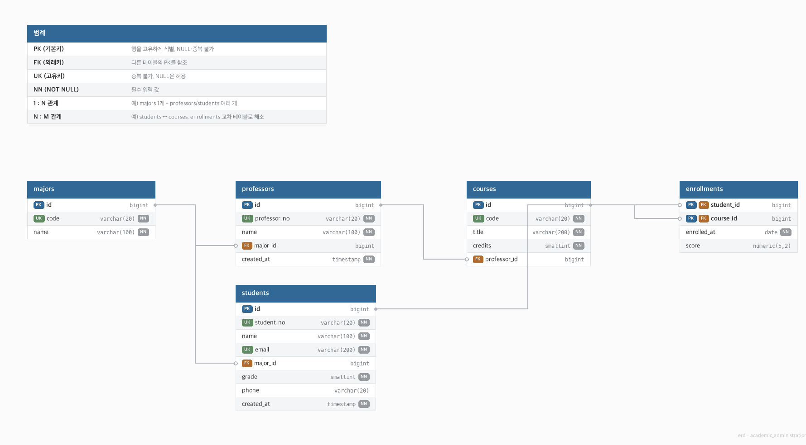

---

## 2. PostgreSQL 접속 확인 화면

터미널에서 `psql` 명령으로 서버에 접속한 화면과, GUI 도구인 pgAdmin으로 접속해서 만든 데이터베이스가 잘 보이는 화면을 각각 캡처했습니다.

<!-- 파일명: screenshots/connect_psql.png -->
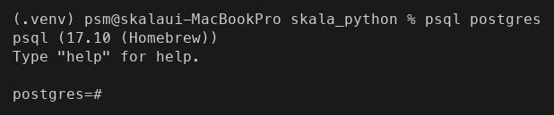

<!-- 파일명: screenshots/connect_pgadmin.png -->
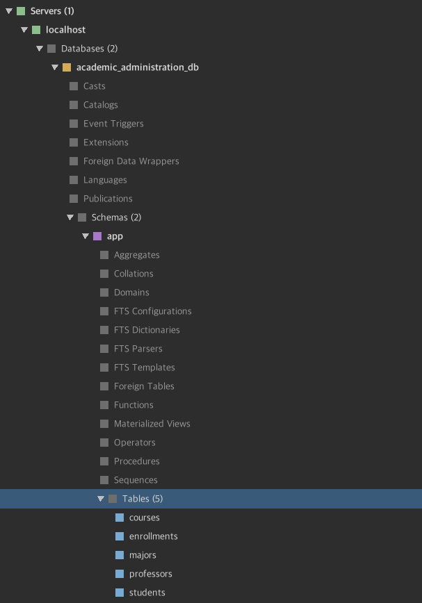

---

## 3. 실습 결과

### 1 — 데이터베이스와 스키마 만들기
새 데이터베이스(`academic_administration_db`)를 만들고, 그 안에 테이블들을 모아둘 스키마(`app`)를 하나 만들었습니다.
```sql
CREATE DATABASE academic_administration_db;
\c academic_administration_db
CREATE SCHEMA app;
SET search_path = app, public;
```
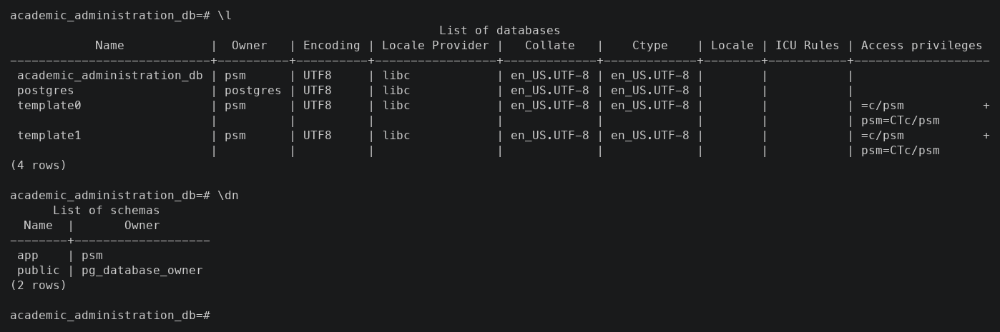

### 2 — 테이블 만들기 (제약조건 포함)
설계한 5개 테이블을 실제로 만들었습니다. 전체 코드는 [../sql/academic_ddl.sql](../sql/academic_ddl.sql)에 있고, 실제 실행한 DDL 전문은 다음과 같습니다.
```sql
-- 1. majors (학과) - 강한 엔티티
CREATE TABLE majors (
    id         BIGINT GENERATED ALWAYS AS IDENTITY PRIMARY KEY,
    code       VARCHAR(20)  NOT NULL UNIQUE,
    name       VARCHAR(100) NOT NULL
);

-- 2. professors (교수) - 강한 엔티티, majors 참조
CREATE TABLE professors (
    id            BIGINT GENERATED ALWAYS AS IDENTITY PRIMARY KEY,
    professor_no  VARCHAR(20)  NOT NULL UNIQUE,
    name          VARCHAR(100) NOT NULL,
    major_id      BIGINT REFERENCES majors(id),
    created_at    TIMESTAMPTZ  NOT NULL DEFAULT now()
);

-- 3. students (학생) - 강한 엔티티, majors 참조
CREATE TABLE students (
    id          BIGINT GENERATED ALWAYS AS IDENTITY PRIMARY KEY,
    student_no  VARCHAR(20)  NOT NULL UNIQUE,
    name        VARCHAR(100) NOT NULL,
    email       VARCHAR(200) NOT NULL UNIQUE,
    major_id    BIGINT REFERENCES majors(id),
    grade       SMALLINT NOT NULL CHECK (grade BETWEEN 1 AND 4),
    phone       VARCHAR(20),
    created_at  TIMESTAMPTZ NOT NULL DEFAULT now()
);

-- 4. courses (강좌) - 강한 엔티티, professors 참조
CREATE TABLE courses (
    id            BIGINT GENERATED ALWAYS AS IDENTITY PRIMARY KEY,
    code          VARCHAR(20)  NOT NULL UNIQUE,
    title         VARCHAR(200) NOT NULL,
    credits       SMALLINT NOT NULL CHECK (credits > 0),
    professor_id  BIGINT REFERENCES professors(id)
);

-- 5. enrollments (수강신청) - 약한 엔티티, students/courses N:M 교차 테이블
CREATE TABLE enrollments (
    student_id   BIGINT NOT NULL REFERENCES students(id) ON DELETE CASCADE,
    course_id    BIGINT NOT NULL REFERENCES courses(id)  ON DELETE CASCADE,
    enrolled_at  DATE NOT NULL DEFAULT CURRENT_DATE,
    score        NUMERIC(5,2),
    PRIMARY KEY (student_id, course_id)
);

-- 역방향 조회 최적화 (course_id 기준 검색)
CREATE INDEX idx_enrollments_course_student ON enrollments (course_id, student_id);
```
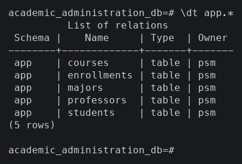

### 3 — 샘플 데이터 넣기
테이블마다 최소 10건씩 데이터를 넣었습니다 (학과 10 / 교수 15 / 학생 20 / 강좌 15 / 수강신청 25건). 신규로 추가한 학과 5곳(AI/통계/법학/화학공학/건축)도 각각 교수 1명·학생 1명·강좌 1개·수강신청 1건을 배정해서 "교수도 학생도 없는 학과"가 남지 않도록 맞췄습니다. 전체 코드는 [../sql/academic_dml.sql](../sql/academic_dml.sql)에 있고, 실제 실행한 INSERT문 전문은 다음과 같습니다.
```sql
-- 1. majors (10건)
INSERT INTO majors (code, name) VALUES
('CS',   '컴퓨터공학'),
('BIZ',  '경영학'),
('EE',   '전자공학'),
('KOR',  '국어국문학'),
('ME',   '기계공학'),
('AI',   '인공지능학과'),
('STAT', '통계학과'),
('LAW',  '법학과'),
('CHEM', '화학공학과'),
('ARCH', '건축학과');

-- 2. professors (15건, major_id = majors.id 순서대로 참조 - 신규 학과 5곳도 각 1명씩 배정)
INSERT INTO professors (professor_no, name, major_id) VALUES
('P001', '김민준', 1),
('P002', '이서연', 1),
('P003', '박도윤', 2),
('P004', '최지우', 2),
('P005', '정하은', 3),
('P006', '강시우', 3),
('P007', '조유진', 4),
('P008', '윤재원', 4),
('P009', '임소율', 5),
('P010', '한도현', 5),
('P011', '배지훈', 7),
('P012', '서수아', 8),
('P013', '노형준', 9),
('P014', '홍은채', 10),
('P015', '문가온', 11);

-- 3. students (20건, 2024015는 학과 미배정(NULL) - COALESCE/LEFT JOIN 실습용, 2024016~020은 신규 학과 5곳에 각 1명씩 배정)
INSERT INTO students (student_no, name, email, major_id, grade, phone, created_at) VALUES
('2024001', '홍길동',   'hong@skala.ai',        1, 1, '010-1111-2222', '2026-03-02'),
('2024002', '이순신',   'lee@skala.ai',         1, 2, NULL,             '2026-03-02'),
('2024003', '강감찬',   'kang@skala.ai',        1, 3, '010-3333-4444', '2026-03-03'),
('2024004', '유관순',   'yu@skala.ai',          2, 1, '010-5555-6666', '2026-03-03'),
('2024005', '안중근',   'ahn@skala.ai',         2, 4, NULL,             '2026-03-04'),
('2024006', '신사임당', 'shin@skala.ai',        2, 2, '010-7777-8888', '2026-03-04'),
('2024007', '장영실',   'jang@skala.ai',        3, 3, '010-9999-0000', '2026-03-05'),
('2024008', '허준',     'heo@skala.ai',         3, 1, NULL,             '2026-03-05'),
('2024009', '세종대왕', 'sejong@skala.ai',      3, 4, '010-1212-3434', '2026-03-06'),
('2024010', '정약용',   'jeong@skala.ai',       4, 2, '010-5656-7878', '2026-03-06'),
('2024011', '김유신',   'kimys@skala.ai',       4, 3, NULL,             '2026-03-07'),
('2024012', '을지문덕', 'eulji@skala.ai',       4, 1, '010-9090-1212', '2026-03-07'),
('2024013', '광개토',   'gwang@skala.ai',       5, 4, '010-3434-5656', '2026-03-08'),
('2024014', '계백',     'gyebaek@skala.ai',     5, 2, NULL,             '2026-03-08'),
('2024015', '최영',     'choiyoung@skala.ai',   NULL, 1, '010-7878-9090', '2026-03-10'),
('2024016', '오지안',   'ohjian@skala.ai',      7, 1, '010-1010-2020', '2026-03-11'),
('2024017', '배서준',   'baeseojun@skala.ai',   8, 2, NULL,             '2026-03-11'),
('2024018', '정하윤',   'jeonghayoon@skala.ai', 9, 3, '010-2020-3030', '2026-03-12'),
('2024019', '강지우',   'kangjiwoo@skala.ai',   10, 1, NULL,            '2026-03-12'),
('2024020', '윤소이',   'yoonsoi@skala.ai',     11, 4, '010-4040-5050', '2026-03-13');

-- 4. courses (15건, professor_id = professors.id 순서대로 참조, 신규 학과 5곳도 1과목씩 개설(1학점 개론 과목))
INSERT INTO courses (code, title, credits, professor_id) VALUES
('CS101',   '데이터베이스',     3, 1),
('CS102',   '알고리즘',        3, 2),
('BIZ101',  '마케팅원론',      3, 3),
('BIZ102',  '재무관리',        3, 4),
('EE101',   '회로이론',        3, 5),
('EE102',   '반도체공학',      3, 6),
('KOR101',  '한국문학사',      2, 7),
('KOR102',  '국어문법론',      2, 8),
('ME101',   '열역학',          3, 9),
('ME102',   '유체역학',        3, 10),
('AI101',   '인공지능개론',    1, 11),
('STAT101', '통계학개론',      1, 12),
('LAW101',  '법학개론',        1, 13),
('CHEM101', '화학공학개론',    1, 14),
('ARCH101', '건축학개론',      1, 15);

-- 5. enrollments (25건, student_id/course_id = 위 순서대로 참조, 일부 score NULL = 성적 미입력)
INSERT INTO enrollments (student_id, course_id, enrolled_at, score) VALUES
(1,  1, '2026-03-02', 95.5),
(1,  2, '2026-03-02', 88.0),
(2,  1, '2026-03-02', 76.0),
(3,  2, '2026-03-03', NULL),
(4,  3, '2026-03-02', 90.0),
(4,  4, '2026-03-02', 85.5),
(5,  3, '2026-03-03', NULL),
(6,  4, '2026-03-02', 99.0),
(7,  5, '2026-03-02', 72.5),
(7,  6, '2026-03-03', 80.0),
(8,  5, '2026-03-02', NULL),
(9,  6, '2026-03-02', 91.0),
(10, 7, '2026-03-02', 88.5),
(11, 8, '2026-03-02', 79.0),
(12, 7, '2026-03-03', NULL),
(13, 9, '2026-03-02', 95.0),
(14, 10, '2026-03-02', 84.0),
(15, 1, '2026-03-04', 70.0),
(2,  2, '2026-03-03', 82.0),
(3,  1, '2026-03-02', 93.5),
(16, 11, '2026-03-11', 92.0),
(17, 12, '2026-03-11', NULL),
(18, 13, '2026-03-12', 85.0),
(19, 14, '2026-03-12', NULL),
(20, 15, '2026-03-13', 78.5);
```
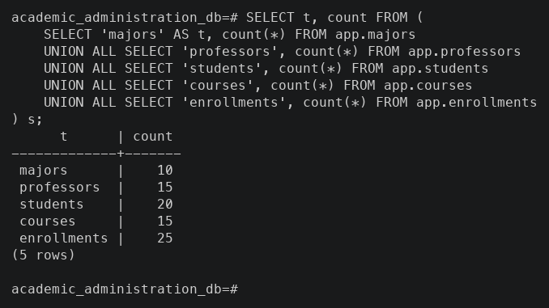

### 4.1 — 조건으로 걸러서 조회하기
컴퓨터공학과 학생 중에서 2학년 이상인 사람만, 학년이 높은 순으로 조회했습니다.
```sql
SELECT student_no, name, grade, phone
FROM app.students
WHERE major_id = 1 AND grade >= 2
ORDER BY grade DESC, name ASC;
```
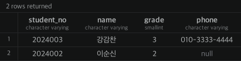

### 4.2 — 범위 조건으로 조회하기
학점이 3~4학점인 강좌만 강좌코드 순으로 조회했습니다.
```sql
SELECT code, title, credits
FROM app.courses
WHERE credits BETWEEN 3 AND 4
ORDER BY code;
```
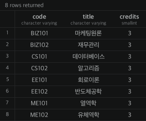

### 4.3 — 빈 값 대신 다른 값 보여주기 (COALESCE)
전화번호를 등록하지 않은 학생은 빈 칸 대신 "미등록"이라는 글자가 보이게 했습니다.
```sql
SELECT student_no, name, COALESCE(phone, '미등록') AS phone_display
FROM app.students
ORDER BY student_no;
```
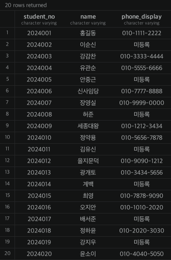

### 문항 4.4 — 조건에 따라 다른 글자로 바꿔 보여주기 (CASE WHEN)
학년 숫자(1~4)를 그대로 보여주는 대신, 1학년은 "신입생", 4학년은 "졸업반"처럼 사람이 읽기 편한 말로 바꿔서 보여줬습니다.
```sql
SELECT student_no, name,
       CASE grade
           WHEN 1 THEN '신입생'
           WHEN 4 THEN '졸업반'
           ELSE grade || '학년'
       END AS grade_label
FROM app.students
ORDER BY grade;
```
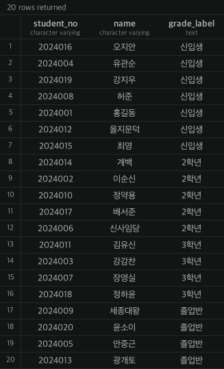

### 4.5 — 날짜 계산해서 보여주기
학생이 등록된 연도, 등록 날짜, 그리고 오늘까지 며칠이 지났는지를 계산해서 같이 보여줬습니다.
```sql
SELECT student_no, name,
       EXTRACT(YEAR FROM created_at)      AS joined_year,
       TO_CHAR(created_at, 'YYYY-MM-DD')  AS joined_date,
       (CURRENT_DATE - created_at::date)  AS days_since_joined
FROM app.students
ORDER BY created_at;
```
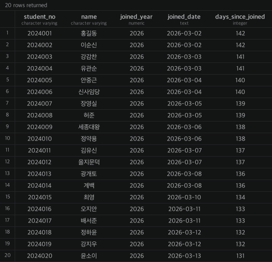

### 4.6 — 여러 테이블 한꺼번에 이어붙여서 조회하기 (JOIN)
학생, 수강신청, 강좌, 교수, 학과 — 이렇게 5개 테이블을 전부 연결해서, "누가 어떤 강좌를 누구한테 배우고 성적이 몇 점인지"를 한 줄로 볼 수 있게 했습니다. 성적이 아직 안 나온 경우는 "미입력"으로, 학과가 없는 학생은 "미배정"으로 표시했습니다.
```sql
SELECT s.student_no AS 학번, s.name AS 학생,
       COALESCE(m.name, '미배정') AS 학과,
       c.title AS 강좌명, p.name AS 담당교수,
       COALESCE(e.score::text, '미입력') AS 성적
FROM app.enrollments e
JOIN app.students s   ON s.id = e.student_id
JOIN app.courses c    ON c.id = e.course_id
JOIN app.professors p ON p.id = c.professor_id
LEFT JOIN app.majors m ON m.id = s.major_id
ORDER BY s.student_no, c.code;
```
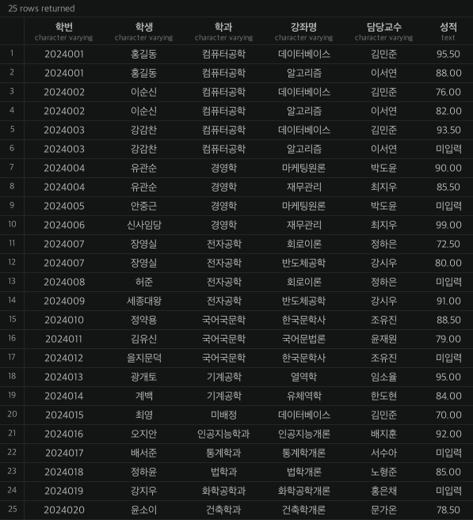

### 4.7 — 점수를 등급으로 바꿔서 보여주기
숫자 점수를 A/B/C/D/F 등급으로 바꿔서 보여주는 쿼리를 추가로 만들어봤습니다. 90점 이상은 A, 80점 이상은 B처럼 구간을 나눠서 CASE WHEN을 조금 더 응용해봤습니다.
```sql
SELECT s.student_no AS 학번, s.name AS 학생, c.title AS 강좌명, e.score AS 점수,
       CASE
           WHEN e.score IS NULL THEN '미입력'
           WHEN e.score >= 90   THEN 'A'
           WHEN e.score >= 80   THEN 'B'
           WHEN e.score >= 70   THEN 'C'
           WHEN e.score >= 60   THEN 'D'
           ELSE 'F'
       END AS 등급
FROM app.enrollments e
JOIN app.students s ON s.id = e.student_id
JOIN app.courses c  ON c.id = e.course_id
ORDER BY s.student_no, c.code;
```
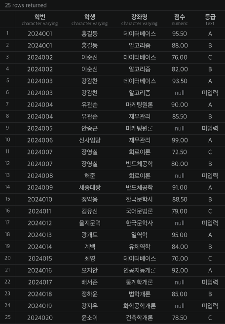

---

## 5. 실습하면서 느낀 점

- 처음엔 엔티티를 몇 개로 나눠야 할지 감이 안 왔는데, "학과 하나에 여러 명이 속한다"처럼 관계의 모양을 먼저 따져보니 테이블 개수와 구조가 자연스럽게 정해졌습니다.
- 학생-강좌처럼 양쪽 다 여러 개로 연결되는 관계(N:M)는 FK 하나로 안 되고, 중간 테이블을 만들어야 한다는 것을 직접 만들어보면서 이해했습니다.
- enrollments 테이블에 성적을 같이 넣다 보니 "신청하는 순간 성적이 왜 있냐"는 의문이 들었는데, 실제로는 신청 시점엔 비워두고(NULL) 학기가 끝난 뒤에 채워지는 값이라는 것을 알게 됐습니다.
- COALESCE, CASE WHEN 둘 다 "빈 값이나 애매한 값을 사람이 읽기 편하게 바꿔주는" 역할이라는 공통점이 있다는 것을 느꼈습니다.
- 학과를 5개에서 10개로 늘릴 때, `majors` 테이블에만 행을 추가하면 끝나는 게 아니라 그 학과에 속한 교수·학생·강좌·수강신청까지 같이 채워야 "교수도 학생도 없는 유령 학과"가 생기지 않는다는 것을 알게 됐습니다. FK로 연결된 테이블은 한쪽만 늘려서는 데이터 앞뒤가 안 맞는다는 걸 다시 한번 확인한 부분입니다.
