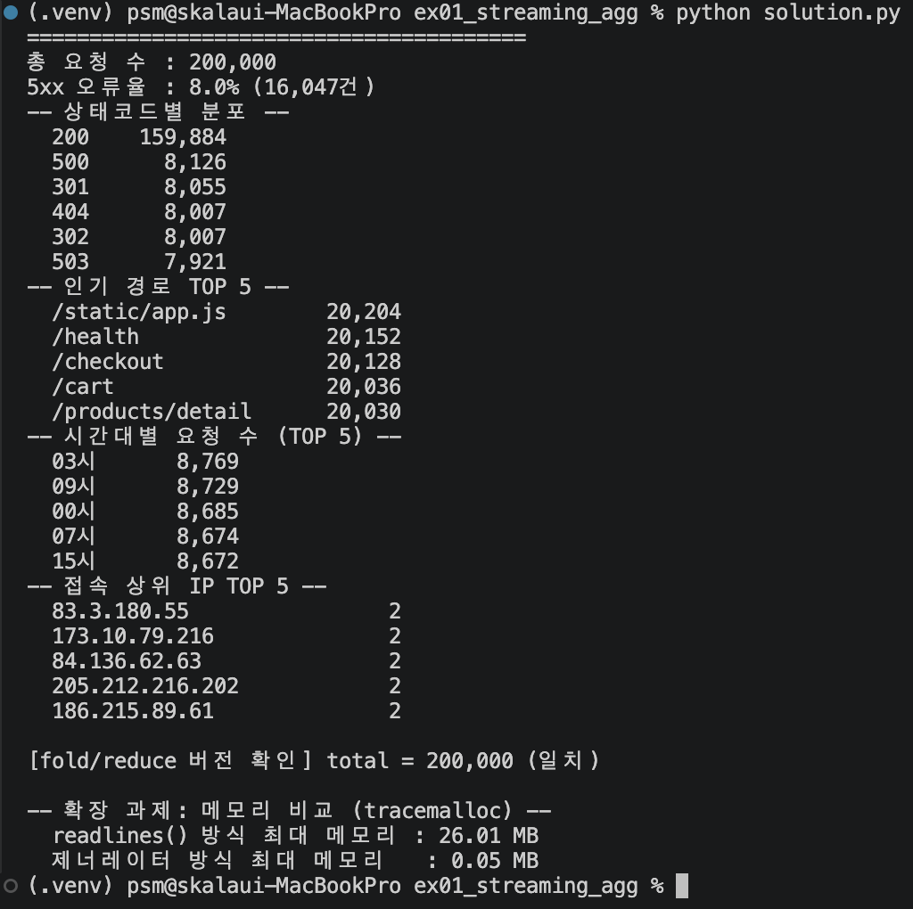

# 실습 1 · 대용량 로그 스트리밍 집계

`web_logs.csv`(20만 행)를 메모리에 전부 올리지 않고, 제너레이터로 한 줄씩 흘려보내며
단 한 번의 순회(one-pass)로 상태코드별·경로별·시간대별·IP별 지표를 동시에 집계한다.

## 실행 방법

```bash
cd skala_python
.venv/bin/python ex01_streaming_agg/solution.py
```

## 실행 결과



## 결과물에 대한 평가

### 체크포인트 충족 여부

| 가이드 성공 판정 기준 | 실제 결과 | 충족 |
|---|---|---|
| 총 건수 200,000 정확히 출력 | `200,000` | ✅ |
| 5xx 비율 약 8% | `8.0%` (16,047건) | ✅ |
| 경로별·시간대별 요약 + 상위 IP 표 출력 | 전부 출력됨 | ✅ |
| Traceback 없이 종료 | 정상 종료 | ✅ |

### 잘된 점
- `read_logs()`가 `yield`로만 구현되어 있어 파일 크기가 커져도(20만 행 → 2억 행) 코드 수정 없이 동작한다.
- 4개 지표(`by_status`, `by_path`, `by_ip`, `by_hour`)를 **단일 for 루프**에서 채워, 파일을 여러 번 읽지 않는다(1-pass).
- `functools.reduce` 기반 `aggregate_with_reduce()`와 `for` 루프 결과가 동일함을 `assert`로 직접 검증해, "같은 계산을 다른 문법으로 표현했다"는 것을 코드로 증명했다.
- `tracemalloc` 확장 과제로 `readlines()`(26.01MB) vs 제너레이터(0.05MB) 차이를 **실측**해 이 실습의 핵심 주장을 숫자로 뒷받침했다.

### 한계 / 아쉬운 점
- 시간대별 집계는 `sorted(by_hour.items(), key=lambda kv: -kv[1])`로 수동 정렬했는데, `Counter`를 썼다면 `most_common()`으로 더 간결하게 표현할 수 있었다(`by_hour`도 `Counter`이므로 실제로는 `most_common(5)`로 대체 가능 — 일관성 측면에서 개선 여지가 있음).
- 메모리 비교(`compare_memory`)가 `read_logs(path)`를 한 번 더 순회하므로, 스크립트 전체 실행 시간에는 제너레이터 방식 대비 약간의 오버헤드가 추가된다. 프로덕션 코드라면 이 확장 과제 로직은 별도 스크립트로 분리하는 편이 더 깔끔하다.