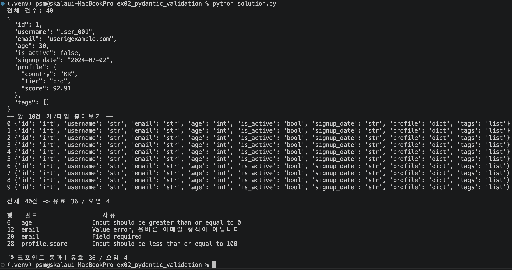

# 실습 2 · Pydantic v2 중첩 스키마 검증

`api_response.json`(40건, 중첩 구조)을 Pydantic v2 모델로 검증하여 유효/오염 데이터를
분리하고, 오염 건은 "왜 탈락했는지"를 필드명·사유와 함께 남긴다.

## 실행 방법

```bash
cd skala_python
.venv/bin/python ex02_pydantic_validation/solution.py
```

## 실행 결과



## 결과물에 대한 평가

### 체크포인트 충족 여부

| 가이드 성공 판정 기준 | 실제 결과 | 충족 |
|---|---|---|
| 오류 없이 종료 | 정상 종료 | ✅ |
| 40건 → 유효 36 / 오염 4 정확히 분리 | `유효 36 / 오염 4` | ✅ |
| 오염 건마다 필드명 + 이유 표 출력 | 4행 표 출력됨 | ✅ |

### 잘된 점
- 오염 4건의 **정확한 원인**을 `python_data/generate_data.py`의 `gen_api_response()`를 직접 읽어서 확인한 뒤 스키마를 설계했다. 그 결과 `age: Field(ge=0)`, `email` 형식 검증(`field_validator`), `email` 필수 필드, `profile.score: Field(le=100)` 네 규칙이 실제 오염 4건(uid 7/13/21/29)과 정확히 1:1로 대응한다 — 우연이 아니라 근거를 갖고 설계했다는 뜻이다.
- `profile: Profile`처럼 타입 자리에 다른 `BaseModel`을 넣어 중첩 검증을 자동화했고, 검증 실패 시 `err['loc']`가 `('profile', 'score')`처럼 중첩 경로를 그대로 보여준다.
- `try/except ValidationError`를 **루프 안에서** 감싸 한 건이 실패해도 나머지 39건을 계속 검사하도록 했고, `except Exception`으로 뭉뚱그리지 않아 진짜 버그(오타 등)를 숨기지 않는다.
- `email-validator` 패키지가 가상환경에 없다는 걸 확인한 뒤, `EmailStr` 대신 직접 `field_validator`로 최소 형식 검사를 구현해 불필요한 의존성 추가를 피했다.

### 한계 / 아쉬운 점
- 이메일 형식 검사가 `'@' in v and '.' in v.split('@')[-1]`로 매우 단순해, `a@b.`처럼 실제로는 유효하지 않은 형식도 통과시킬 수 있다. 지금 데이터셋(`'not-an-email'` 하나만 검사하면 되는 상황)에는 충분하지만, 실제 서비스라면 `email-validator` 패키지 설치가 맞는 선택이다.
- `signup_date: date`로 선언해 문자열을 자동으로 날짜 타입으로 변환하고 있는데, 정작 리포트 출력(`inspect`)에서는 이 필드를 활용하지 않는다 — 검증 스키마와 출력 내용이 완전히 대칭적이진 않다.