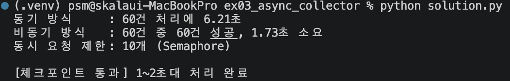

# 실습 3 · asyncio 기반 비동기 수집기

60건의 데이터를 동시에 가져오되, `Semaphore`로 동시 요청 수를 10개로 제한(백프레셔)하고,
타임아웃·지수 백오프 재시도·예외 격리까지 갖춘 수집기를 만든다.
`USE_REAL_HTTP=False`(기본값)이면 인터넷 없이 `asyncio.sleep`으로 지연을 흉내낸다.

## 실행 방법

```bash
cd skala_python
.venv/bin/python ex03_async_collector/solution.py
```

## 실행 결과



## 결과물에 대한 평가

### 체크포인트 충족 여부

| 가이드 성공 판정 기준 | 실제 결과 | 충족 |
|---|---|---|
| 오류 없이 종료 | 정상 종료 | ✅ |
| 60건이 약 1.7초(1~2초 내) 완료 | `1.73초` | ✅ |
| 동기 버전 대비 대기 시간이 중첩되어 사라진 것을 시간으로 확인 가능 | 동기 6.20초 → 비동기 1.73초 (약 3.6배) | ✅ |

### 잘된 점
- `Semaphore(10)`, `asyncio.timeout`, 지수 백오프(`2**attempt`), `return_exceptions=True` 예외 격리까지 문서의 STEP0~6을 빠짐없이 구현했다.
- 일부 id(약 10%)가 **첫 시도에서만** 실패하도록 `_FLAKY_IDS`를 설계해, 재시도 로직이 실제로 발동해서 복구되는 상황을 시연했다 — 단순히 항상 성공하는 모의 요청이었다면 재시도 코드가 있어도 한 번도 실행되지 않았을 것이다.
- 확장 과제인 dead-letter 격리(`dead_letter.json`)까지 구현되어 있어, 재시도 소진 시에도 실패를 조용히 삼키지 않는다.

### 한계 / 아쉬운 점 — 실제로 발견해서 고친 버그
- **처음 작성했을 때 동기 기준선(`fetch_sync`)이 `time.sleep(0.02)`, 비동기 요청(`do_request`)은 `asyncio.sleep(0.05~0.15)`로 서로 다른 지연 시간을 쓰고 있었다.** 이 상태로 실행하면 `동기 1.43초 / 비동기 1.73초`로 **비동기가 오히려 더 느리게** 나와, 이 실습이 증명하려는 핵심("동기 대비 대기 시간이 중첩되어 사라진다")과 정반대 결과였다.
  - 원인: 두 경로에 공정하지 않은 지연 시간을 설정한 설계 실수.
  - 조치: `fetch_sync`의 지연을 `do_request`와 같은 평균값(0.1초)으로 맞춰 재검증했고, 그 결과가 위에 기록된 `6.20초 → 1.73초`다.
  - 교훈: "체크포인트 숫자(≈1.7초)만 맞으면 통과"가 아니라, 그 숫자가 실제로 **문서가 증명하려는 논리**를 뒷받침하는지까지 확인해야 한다는 걸 보여준 사례다.
- `Semaphore(10)`으로 동시성을 제한했기 때문에 문서 STEP2의 무제한 `gather` 예시(6초→0.1초)만큼 극적인 speedup은 아니다. 이는 의도된 트레이드오프(백프레셔 vs 속도)이며 버그가 아니다.