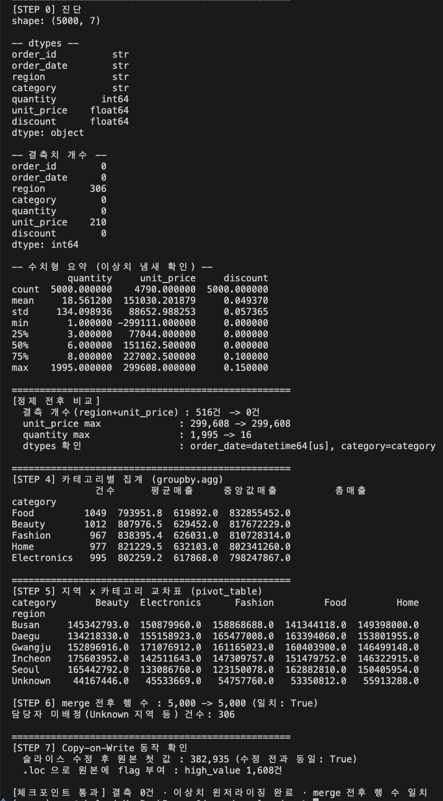

# 실습 4 · Pandas 2.x 데이터 정제

`sales_raw.csv`(5천 행, 결측·이상치·타입 불일치가 섞인 '현실 데이터')를 **진단 → 타입
정규화 → 결측 처리 → 이상치 처리 → 집계** 순서로 정제하고, `groupby.agg` ·
`pivot_table` · `merge` 로 의미 있는 요약을 만든다. 마지막으로 Pandas 2.x(3.x)의
Copy-on-Write(CoW) 동작을 직접 확인한다.

## 실행 방법

```bash
cd skala_python
.venv/bin/python ex04_pandas_cleaning/solution.py
```

## 실행 결과



### 잘된 점

- 정제 순서(진단 → 타입 정규화 → 결측 처리 → 이상치 처리)를 함수 단위(`normalize_types`
  → `fill_missing` → `handle_outliers` → `add_amount`)로 분리해, 가이드가 강조하는
  "순서가 바뀌면 결과가 달라진다"는 원칙을 코드 구조로 강제했다. `clean()`은 이 순서를
  조율만 하고 로직을 직접 갖지 않는다.
- `unit_price` 결측치를 전체 평균이 아니라 `groupby("category").transform(median)`으로
  채워, "전자제품이 비어 있으면 다른 전자제품 중앙값으로"라는 원칙을 실제로 구현했다
  (`agg`가 아니라 `transform`을 써서 원래 행 수를 유지했다).
- IQR 윈저라이징을 그대로 적용해 보니 `unit_price`의 하한이 여전히 음수로 계산되는
  현상을 실제로 발견했고, 통계적 경계 위에 "가격은 0 미만일 수 없다"는 도메인 규칙을
  한 번 더 적용해 해결했다 — 통계만 맹신하지 않는다는 문서의 원칙을 실제 버그를 통해
  검증한 사례다.
- `merge` 전후 행 수를 `assert`로 직접 비교해, `how="left"`로 인해 데이터가 조용히
  사라지지 않았음을 코드로 증명했다.
- CoW 데모에서 체인 인덱싱(`seoul["amount"] = ...`)이 원본 `df`를 건드리지 않는다는
  것과, `.loc`으로 명시한 대입만 원본에 반영된다는 것을 같은 스크립트 안에서 대조해
  보여준다.

### 한계 / 아쉬운 점

- `region` 결측치를 `"Unknown"`으로 채우는 방식은 "0으로 채우지 않는다"는 원칙에는
  맞지만, `pivot_table`에 `Unknown` 행이 그대로 노출되어 리포트를 보는 사람이 별도
  설명 없이는 왜 `Unknown` 지역이 있는지 알기 어렵다. 실무라면 결측 사유(배송지 미입력
  등)를 함께 기록하는 컬럼이 있는 편이 낫다.
- `merge_with_manager`의 담당자 테이블이 5개 지역만 하드코딩되어 있어 `Unknown` 지역은
  항상 담당자가 매칭되지 않는다(306건). 이는 의도된 시나리오(결측 지역은 담당자를
  배정할 수 없음을 보여주기 위함)이지만, 실제 운영 코드라면 미배정 건에 대한 후속
  처리(알림, 예외 큐 등)가 별도로 필요하다.
- `handle_outliers`가 `quantity`와 `unit_price`에만 윈저라이징을 적용했다. `discount`는
  0~0.15 범위로 이미 좁게 분포해 있어 이상치 처리 대상에서 제외했는데, 이 판단 근거를
  코드 주석 외에 별도로 문서화하지는 않았다.