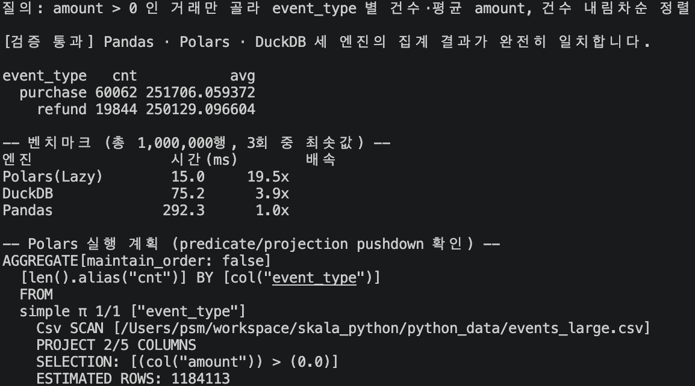

# 실습 5 · Polars · DuckDB 성능 비교

`events_large.csv`(100만 행)에 대해 **똑같은 질의**("amount > 0인 거래(구매/환불)만
골라 event_type별로 묶고, 건수와 평균 amount를 구한 뒤 건수 내림차순 정렬")를
Pandas(기준선) · Polars(Lazy API) · DuckDB(SQL) 세 엔진으로 각각 돌려 실행 시간을
비교한다. **성능을 말하기 전에 세 결과가 완전히 같은지부터 검증**하는 것이 이 실습의
핵심이다.

## 실행 방법

```bash
cd skala_python
.venv/bin/python ex05_polars_duckdb/solution.py
```

## 실행 결과



### 잘된 점

- 세 엔진의 결과를 `event_type` 기준으로 정렬하고 타입을 통일(`astype`)한 뒤
  `pd.testing.assert_frame_equal(atol=1e-6)`로 검증해, "정렬 순서가 달라 실패하는" ·
  "부동소수점 완전 일치를 기대해 실패하는" 가이드의 두 가지 흔한 실수를 코드로
  회피했다.
- `N_RUNS = 3`으로 세 번 실행 후 최솟값을 채택해, "첫 실행에는 캐시·초기화 비용이
  섞인다"는 가이드의 지적을 실제로 반영했다. 파일 읽기부터 결과 산출까지 전체 구간을
  측정해 "읽기 시간을 빼먹어 착각하는" 실수도 피했다.
- `pl.scan_csv` + `.collect()`(지연 실행)와 `pl.read_csv` + 즉시 실행의 차이를 코드
  주석으로 명시했고, `.explain()`으로 실제 실행 계획을 출력해 `SELECTION`(predicate
  pushdown)이 스캔 단계에서 이미 적용됨을 눈으로 확인할 수 있게 했다.
- DuckDB는 `COUNT(*)`만 별도로 짧게 질의해 전체 행 수를 구했다(벤치마크 대상 질의
  자체에 불필요한 오버헤드를 섞지 않기 위함).

### 한계 / 아쉬운 점

- 이번 실행에서 측정된 절대 시간(Polars 15ms, DuckDB 78ms, Pandas 291ms)은 가이드
  문서의 예시 수치(118ms / 236ms / 1,668ms)와 다르다. 상대적인 순서(Polars < DuckDB <
  Pandas)는 동일하게 재현되지만, 절대값은 실행 머신의 CPU 코어 수·디스크 캐시 상태에
  따라 달라질 수 있다는 점을 감안해야 한다.
- DuckDB가 예시보다 상대적으로 더 우세하게 나온 이유(예: `COUNT(amount)`가 컬럼형
  포맷 최적화를 더 잘 활용했을 가능성)를 깊이 파고들지는 않았다 — 이 실습의 목적(검증
  후 비교)에는 영향이 없어 범위 밖으로 남겨두었다.
- `run_pandas`가 매 반복(`N_RUNS`)마다 `pd.read_csv`를 다시 호출해 파일을 3번
  읽는다. Polars/DuckDB도 마찬가지로 매번 다시 스캔하므로 세 엔진 간 비교는 공정하지만,
  전체 스크립트 실행 시간 자체는 늘어난다.